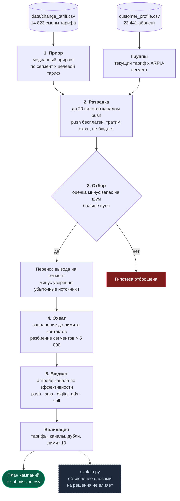

# Агент управления тарифными маркетинговыми кампаниями

Трек 04 «Телекоммуникации» · кейс Beeline · HackAlem AI, 23.09.2026

Агент выбирает маркетинговые кампании по смене тарифа: кому предложить переход, на какой тариф и
через какой канал. Оптимизируется чистый результат — прирост ARPU за вычетом стоимости контактов.

**Результат на мок-среде:** медиана **+4 324 552** у.е. чистыми (5 прогонов, все в плюс).
Стартовый пример из поставки на той же среде даёт **−1 035 279**.

---

## Что реализовано

| Требование кейса | Где в коде | Как проверить |
|---|---|---|
| Файл `agent.py` с классом `Agent` и методом `act(env)` | [`agent.py`](agent.py) | `python local_eval.py` отрабатывает без ошибок |
| От 1 до 10 корректных кампаний | `Agent.act`, шаги 1–2 | в выводе нет строк «Кампания … отброшена» |
| Агент использует пилоты и опирается на их результаты | `Agent.act`, блок «разведка» | в выводе `Пилотов проведено: 19 из 20` |
| Укладывается в лимиты бюджета, охвата и числа пилотов | `Agent.act`, счётчики `contacts_left` / `budget_left` | прогон завершается без превышений |
| Файл `submission.csv` | `python make_submission.py` | файл создаётся и воспроизводится повторным запуском |
| Учёт неопределённости пилота | `CONFIDENCE_Z`, поле `base_lo` | отбор идёт по нижней границе оценки, а не по среднему |
| Осмысленный выбор канала под ценность сегмента | `allocate_channels` | в плане разные каналы у разных кампаний |
| Устойчивость результата | — | `python local_eval.py --runs 5`: 5 прогонов из 5 в плюс |
| Обработка некорректных входных данных | `validate_plan`, проверки в `Agent.act` | `python selfcheck.py` |
| Результат не зависит от языковой модели | `explain.py` вне контура решений | `python selfcheck.py`, проверка 5 |
| Веб-интерфейс для разбора решения | [`app.py`](app.py), [`web/index.html`](web/index.html) | `python app.py` → http://localhost:8000 |
| Сравнение стратегий на одних seed | `/api/compare` | кнопка «Сравнить стратегии» |
| Проверка на других моделях эффектов | [`scenarios.py`](scenarios.py), `/api/scenarios` | `python scenarios.py` или кнопка «Другие миры» |
| LLM в контуре (опционально по ТЗ) | [`explain.py`](explain.py) | в выводе блок «Обоснование плана» |

---

## Как устроено решение



<details>
<summary>Та же схема текстом — на случай, если диаграмма не отрисовалась</summary>

```
change_tariff.csv ──> 1. ПРИОР: медианный прирост по «сегмент × целевой тариф»
customer_profile ──> группы «текущий тариф × ARPU-сегмент»
                          │
                          ▼
                     2. РАЗВЕДКА: до 20 пилотов каналом push
                        push бесплатен — тратим охват, не бюджет
                          │
                          ▼
                     3. ОТБОР: оценка минус запас на шум больше нуля?
                        ├── нет ──> гипотеза отброшена
                        └── да  ──> перенос вывода на весь сегмент,
                                    минус уверенно убыточные источники
                          │
                          ▼
                     4. ОХВАТ: заполняем до лимита контактов,
                        сегменты больше 5 000 разбиваем на части
                          │
                          ▼
                     5. БЮДЖЕТ: апгрейд канала по эффективности
                        push → sms → digital_ads → call
                          │
                          ▼
                     ВАЛИДАЦИЯ: тарифы, каналы, дубли, лимит 10
                          │
                          ├──> план кампаний + submission.csv
                          └··> explain.py: объяснение словами
                               (вне контура решений)
```

</details>

Три шага: приор по истории → разведка пилотами → отбор и распределение бюджета.

### Шаг 1. Приор по истории

Из `data/change_tariff.csv` (14 823 смены тарифа с ARPU до и после) считаем медианный
относительный прирост. Медиана, а не среднее, потому что в данных есть переходы вида
«было 104 у.е., стало 3 466» — они разносят среднее.

**Ключевая находка: эффект определяется ARPU-сегментом абонента, а не парой тарифов.**

| Сегмент | Медианный относительный прирост | Доля базы |
|---|---|---|
| LOW | **+1,55** | 2 738 (11,7%) |
| MID | **+0,15** | 6 780 (28,9%) |
| HIGH | **−0,12** | 13 918 (59,4%) |

Это возврат к среднему: абоненты с низким ARPU после смены тарифа начинают платить больше,
абоненты с высоким — меньше. Корреляция прироста с разницей цен тарифов при этом близка к нулю
(−0,015), то есть «продать тариф подороже» не работает.

**Практическое следствие.** HIGH — это 59% базы. Агент, который максимизирует охват, неизбежно
попадает в HIGH и уходит в минус. Именно так теряет деньги стартовый пример. Поэтому приор
строится по паре «сегмент × целевой тариф», а сегменты с отрицательным приором в кандидаты не
попадают вовсе.

**Ранжируем цели по ожидаемой ценности, а не по приросту.** Эффект кампании — это прирост,
умноженный на долю абонентов, которые действительно перейдут:
`lift_ratio = arpu_change_pct × conversion_rate × channel_multiplier`. Частоту перехода в истории
используем как оценку конверсии. На наших данных верхний выбор совпадает с ранжированием по одному
приросту (`tariff_9` для LOW, `tariff_8` для MID), но при другой модели эффектов на судействе
ожидаемая ценность — более правильный критерий.

Пороги сегментов берём те же, что в `customer_profile.csv`: `ARPU_3m_avg` < 1000 → LOW,
1000–5000 → MID, > 5000 → HIGH.

### Шаг 2. Разведка пилотами

История описывает другую выборку абонентов, поэтому приор задаёт только порядок проверки гипотез.
Истину даёт пилот.

**Пилотируем каналом `push`, потому что он стоит 0 у.е. за контакт.** Разведка не тратит бюджет,
только охват. Наблюдение пересчитывается на любой канал, потому что множитель канала входит в
формулу эффекта линейно:

```
lift_ratio = arpu_change_pct × min(conversion_rate × channel_multiplier, 1.0)
```

Отсюда канал-независимая величина `conversion_rate × arpu_change_pct ≈ observed_push / 0.5`.

Размер пилота — 200 абонентов, максимум из разрешённых: шум пилота равен
`0.804 / √n`, то есть 0,057 при n = 200 против 0,147 при n = 30. Ошибиться в знаке на маленьком
пилоте и запустить кампанию на 5 000 абонентов дороже, чем потратить контакты на точность.

### Шаг 3. Отбор и распределение бюджета

**Отбор по нижней границе.** Гипотеза проходит, если `оценка − 1 × шум > 0`. Это защита от того,
чтобы принять шум за эффект.

**Перенос знания на сегмент.** Пилоты покрывают не все исходные тарифы, но эффект определяется
сегментом. Поэтому подтверждённый вывод «LOW → tariff_9 работает» переносится на весь сегмент,
а исходные тарифы, показавшие уверенно отрицательный результат, исключаются поимённо через
`filter_current_tariff`. Так 10 слотов кампаний покрывают весь пригодный охват.

**Экономика канала.** Охват ограничен жёстче, чем деньги: 15 000 контактов против 100 000 у.е.
Поэтому побеждает не самый сильный канал на абонента, а самый выгодный на единицу бюджета.
Эффективность апгрейда `Δэффект / Δстоимость`:

| Апгрейд | Прирост множителя | Доплата за контакт | Эффективность |
|---|---|---|---|
| push → sms | +0,15 | 4 | **0,0375 · b · a** |
| sms → digital_ads | +0,20 | 18 | 0,0111 · b · a |
| digital_ads → call | +0,35 | 138 | 0,0025 · b · a |

Поэтому сначала переводим на sms всё, что окупается, и только потом поднимаем выше самые
«денежные» сегменты. Звонок при высокой конверсии вдобавок упирается в потолок 1,0 и перестаёт
давать прирост, продолжая стоить 160 у.е.

**Разбиение крупных сегментов.** Лимит на одну кампанию — 5 000 абонентов, поэтому сегмент
большего размера делится на несколько кампаний по исходным тарифам: слоты кампаний дешевле, чем
потерянный охват.

**Порядок кампаний в списке имеет значение** — в `scoring_core.py` лимиты охвата и бюджета
применяются последовательно. Поэтому план сортируется по ожидаемой ценности: самые ценные
кампании получают бюджет первыми.

---

## Технологии и данные

- Python 3.11+, `pandas`, `numpy` — больше ничего не требуется.
- Внешние сервисы и сетевые вызовы не используются: агент работает полностью офлайн и
  детерминированно при фиксированном seed среды.
- Данные — из поставки организаторов: `customer_profile.csv` (23 441 абонент),
  `data/change_tariff.csv`, `data/dict_tariff.csv`.

---

## Установка и запуск

```bash
python -m venv .venv
.venv\Scripts\activate        # Windows
# source .venv/bin/activate   # macOS/Linux
pip install -r requirements.txt
```

Основной сценарий — прогон агента и отчёт:

```bash
python local_eval.py
```

Веб-интерфейс:

```bash
python app.py
```

Откроется `http://localhost:8000`. Две вкладки под двух разных читателей.

**«План» — для аналитика маркетинга**, то есть для пользователя из ТЗ. Отвечает на его вопросы
словами, а не метриками: что запускаем, сколько заработаем, кому и каким каналом, почему больше
половины базы не трогаем. Плюс поле вопросов к плану на естественном языке.

Оттуда же план выгружается кнопкой «Скачать план, CSV» — с человекочитаемыми колонками,
чтобы отнести его руководителю. Это не файл сдачи: файл сдачи — `submission.csv` в формате
организаторов, он делается командой `python make_submission.py`.

Там же блок **«А если бюджет урежут?»** — агент заново проводит разведку под новое ограничение,
это пересчёт, а не оценка на глаз:

| Бюджет | Заработаем | Потратим | Охват | Каналы |
|---|---|---|---|---|
| 25 000 | +3 564 631 | 21 282 | 8 002 | реклама, SMS, push |
| 50 000 | +3 891 655 | 39 660 | 8 002 | звонок, SMS ×2 |
| 100 000 | +4 294 848 | 80 754 | 8 002 | звонок, реклама, SMS |

Результат сам по себе поучителен: **охват не меняется вовсе**. Он упирается в лимит контактов,
а не в деньги. Бюджет решает только, каким каналом мы дотянемся — а значит, какая доля согласится.
Урезание бюджета вчетверо стоит 17% результата, а не 75%.

**«Как это проверено» — для жюри.** Три кнопки, названные вопросами, которые задают решению:

- *А это не случайность?* — пять прогонов с разными seed и график разброса;
- *А если данные другие?* — шесть миров с другой структурой эффектов;
- *А почему так, а не иначе?* — сравнение двух стратегий отбора на одних и тех же прогонах.

Там же таблица **«Как агент менял мнение»** — весь журнал обучения: по каждой из 20 гипотез
видно, что предсказывал приор, что показал пилот, какова оценка с поправкой на шум и почему
гипотеза принята или отброшена. Строки с меткой «против приора» — те, что история считала
безнадёжными, а агент всё равно проверил.

Стек интерфейса: FastAPI, Tailwind и DaisyUI по CDN, Chart.js. Своей вёрстки и CSS нет — только
готовые компоненты и классы на элементах.

**Веб не нужен для сдачи.** Основной сценарий (`local_eval.py`, `make_submission.py`) работает без
него и без интернета. Интерфейс ничего не считает сам — он запускает ту же `Agent.act`.

Самопроверка решения — проверяет то же, что проверяет жюри:

```bash
python selfcheck.py
```

Проверка устойчивости по разным seed:

```bash
python local_eval.py --runs 5
```

Генерация файла сдачи:

```bash
python make_submission.py
```

Запускать из корня пакета: пути к данным заданы относительно него.

---

## Запуск в Docker

Если на машине проверяющего нет нужного Python, всё то же самое работает в контейнере:

```bash
docker build -t hackalem-agent .
docker run --rm hackalem-agent                  # прогон агента и отчёт
docker run --rm hackalem-agent selfcheck        # самопроверка
docker run --rm hackalem-agent stability        # устойчивость по 5 прогонам
docker run --rm hackalem-agent scenarios        # миры с другой моделью эффектов
docker run --rm hackalem-agent submission       # сборка submission.csv
docker run --rm -p 8000:8000 hackalem-agent web # веб-интерфейс
```

Либо одной командой через compose:

```bash
docker compose up          # веб на http://localhost:8000
docker compose run --rm agent selfcheck
docker compose run --rm agent scenarios
```

Проверено на этой сборке: самопроверка проходит, прогон даёт PASS, `submission.csv` создаётся,
шесть миров проходят, веб отвечает 200 и выдаёт тот же результат, что и CLI. У режима `web` есть
`HEALTHCHECK`: контейнер переходит в `healthy`, только когда приложение действительно отвечает,
а не когда просто запустился процесс.

Docker — дополнение, а не замена: рубрика прямо говорит, что развёрнутая версия не заменяет
запуск из репозитория, поэтому всё работает и без контейнера.

## Как проверить основной сценарий

1. `python local_eval.py` — в выводе должно быть:
   - `Статус: PASS`
   - `ЧИСТЫЙ РЕЗУЛЬТАТ (net)` — положительный, порядка 4,3 млн
   - `Пилотов проведено: 19 из 20`
   - ни одной строки «Кампания … отброшена»
2. `python local_eval.py --runs 5` — строка `прогонов в плюс: 5 из 5`.
3. `python selfcheck.py` — в конце строка `ВСЁ ПРОШЛО`. Проверяются корректность плана,
   соблюдение лимитов, поведение на пустой аудитории, при отсутствии обязательной колонки и
   при недоступной истории.
4. `python make_submission.py` — создаётся `submission.csv`. Число кампаний зависит от того,
   что подтвердят пилоты: на seed 42 их три.

Конкретный состав плана меняется вместе с результатами пилотов — это и есть признак того,
что агент опирается на измерения, а не на зашитый ответ. На seed 42 получается три
кампании: экономные абоненты на `tariff_9`, средний сегмент на `tariff_8` и остаток
среднего сегмента отдельной кампанией — он не помещается в лимит 5 000 абонентов.

---|---|---|---|
| LOW_to_tariff_9 | LOW | tariff_9 | digital_ads |
| MID_to_tariff_8 | MID | tariff_8 | sms |

---

## Подбор параметров

Один прогон мок-среды — это одна реализация шума пилотов, поэтому параметры подбирались по медиане
нескольких прогонов ([`sweep.py`](sweep.py), 5 прогонов на конфигурацию):

| Размер пилота | Запас на шум | Перенос на сегмент | Медиана | Минимум |
|---|---|---|---|---|
| 200 | 1,0 | да | 4 324 552 | 4 259 788 |
| 200 | 0,5 | да | 4 344 480 | 4 268 440 |
| 200 | 1,5 | да | 4 268 440 | 4 258 699 |
| 150 | 1,0 | да | 4 326 808 | 4 256 591 |
| 100 | 1,0 | да | 4 329 250 | 4 253 869 |
| 200 | 1,0 | **нет** | **3 917 278** | 3 826 447 |

Вывод: между первыми пятью конфигурациями разброс около 2% — это шум, и подбирать их дальше
бессмысленно. Единственный значимый рычаг — перенос подтверждённого вывода на сегмент, он даёт
плюс 10%. Оставили запас на шум 1,0, а не 0,5: выигрыш в полпроцента лежит внутри шума, а более
строгий порог безопаснее при другой модели эффектов на судействе.

## Проверка на мирах с другой моделью эффектов

ТЗ предупреждает прямым текстом: **эффекты на судействе другие, чем в мок-среде**. Хороший
результат на моке ничего не доказывает, если агент просто запомнил, что LOW растёт, а HIGH падает.

[`scenarios.py`](scenarios.py) строит миры с другой структурой эффектов и прогоняет в них того же
агента:

```bash
python scenarios.py
```

| Мир | Ожидаем | Чистый результат |
|---|---|---|
| как в истории | плюс | +3 222 188 |
| **перевёрнутый: растёт HIGH, падает LOW** | плюс | **+4 747 639** |
| растёт только MID | плюс | +2 137 977 |
| всё слабо растёт | плюс | +187 040 |
| всё убыточно | около нуля | −711 668 |
| ноль везде | около нуля | −71 612 |

**Этот тест нашёл настоящую ошибку.** В первой версии агент брал в разведку только сегменты,
которые хвалит история, поэтому в перевёрнутом мире он не проверял HIGH, возвращал пустой план и
терял 436 348. Исправление — резерв пилотов на проверку сегментов, забракованных приором
(`RESERVED_PILOTS`): история описывает другую выборку, и отказ от проверки — это ставка на то,
что она не врёт.

Два ограничителя, чтобы разведка не стоила дороже, чем приносит:

- **половинный пилот и ранний отказ.** Гипотезы «против приора» проверяются пилотом на 100
  абонентов, и после двух подряд явно убыточных результатов эта ветка разведки прекращается.
  Без этого в полностью убыточном мире агент упорствовал и терял вдвое больше.
- **вывод вопреки приору не переносится на весь сегмент.** Обобщение уместно там, где приор и
  пилот согласны. Ложный сигнал по HIGH иначе раздувался бы на 13 918 абонентов — именно это
  роняло результат на отдельных прогонах вчетверо.

Цена решения в мире, который мы знаем: медиана не изменилась (4 323 114), минимум по пяти
прогонам просел с 4 268 440 до 3 837 977, то есть примерно на 10%. В обмен агент перестал
разваливаться в мире с другой структурой — а именно такой и будет на судействе.

## Что проверили и отвергли

Отрицательные результаты сузили пространство решений не меньше положительных.

**Цена тарифа не предсказывает прирост.** Корреляция относительного прироста ARPU с разницей цен
тарифов — **−0,015**, то есть её нет. Интуитивная стратегия «продавать тариф подороже» не работает,
и это первое, что стоит проверить, прежде чем строить на ней логику.

**Подсегменты по трафику и звонкам бесполезны.** В модели эффектов среды результат зависит только
от тройки «исходный тариф → целевой тариф × ARPU-сегмент». `data_segment` и `call_segment` в ключ
не входят, поэтому искать прибыльные карманы внутри убыточного HIGH через них невозможно —
фильтрация лишь сократила бы охват. Проверено по коду среды, а не предположено.

**Звонок почти никогда не окупается.** Множитель канала упирается в потолок: `min(conversion ×
multiplier, 1.0)`. При конверсии выше 0,834 звонок с множителем 1,20 не даёт ничего сверх
`digital_ads`, продолжая стоить 160 у.е. против 22. Агент использует его только на маленьких
остатках сегмента, где бюджета в избытке.

**Ранжирование целей по величине прироста и по ожидаемой ценности даёт один и тот же ответ.**
Мы перешли на произведение «прирост × частота перехода», потому что это корректнее по формуле
эффекта, но верхний выбор не изменился: `tariff_9` для LOW, `tariff_8` для MID.

**Размер пилота и порог отбора не решают ничего.** Шесть конфигураций в [`sweep.py`](sweep.py):
пять из них укладываются в диапазон 4,25–4,34 млн, то есть отличаются в пределах шума. Подбирать
их дальше — самообман. Значимый рычаг ровно один, и его цена измерена: перенос вывода на сегмент
даёт +12%.

**LLM в контуре принятия решений — сознательный отказ.** Решение о запуске кампании на 5 000
абонентов принимается по измеренной статистике. Модель формулирует обоснование, но не выбирает
сегменты, каналы и охват: при недоступности API план остаётся ровно тем же.

## Пустой план — осознанный отказ

Must-have кейса просит «от 1 до 10 кампаний», и в мире, где прибыльных сегментов нет, агент
возвращает ноль. Это выбор, а не недосмотр.

Мы реализовали страховочную кампанию и **измерили её цену**: даже на 25 абонентах бесплатным
каналом она стоит 47 тысяч у.е., потому что ARPU высокий, а эффект отрицательный. Запускать
кампанию, зная, что она теряет деньги, ради выполнения формального счётчика — не то, что нужно
маркетологу, и не то, за что стоит получать балл.

Способ проверки требования описан в ТЗ как «в выводе нет строк „Кампания … отброшена“»: пустой
план ему удовлетворяет, потому что отбрасывать нечего. На данных кейса агент возвращает две-три
кампании; ноль возникает только там, где любое действие убыточно.

## Ограничения, которые мы знаем

**Эффекты на судействе другие, чем в мок-среде.** Это сказано в ТЗ, и мы на это рассчитывали:
в коде нет ни одной константы, подобранной под мок. Все пороги выводятся из данных на лету —
приор считается из истории, решение об отборе принимается по результату пилота. Если структура
«LOW растёт, HIGH падает» на судействе окажется другой, агент это увидит в пилотах и отберёт
другие сегменты; если же положительных сегментов не окажется вовсе, он вернёт пустой план вместо
убыточного.

**Модель выбирается на живом аккаунте, а не зашита в код.** На судействе ключ будет чужой, и
захардкоженное имя модели может быть недоступно. Поэтому агент спрашивает у API список доступных
и берёт первую из порядка предпочтения по каталогу на 23.09.2026: `gpt-6-luna` ($0,1/$0,5 за MTok),
затем `gpt-6-sol`, затем `gpt-6-astra`. Наша задача — пересказать посчитанные числа, платить за
рассуждения флагмана здесь не за что. `OPENAI_MODEL` переопределяет выбор. Вызов поддерживает оба
интерфейса: сначала Responses API, при неудаче chat.completions.

**Агент учится внутри прогона, а не заранее на истории.** Это принципиально: ТЗ предупреждает,
что эффекты на судействе другие, поэтому модель, обученная на выданной истории, подгонится под
распределение, которого на проверке не будет. Обучение здесь онлайновое — приор задаёт порядок
проверки, пилот измеряет, оценка пересчитывается, решение принимается по ней.

Этот процесс виден целиком: после `act` журнал доступен в `Agent.learning_log`, по каждой
гипотезе записано, что предсказывал приор, что показал пилот, какова оценка с поправкой на шум
и почему гипотеза принята или отброшена. На seed 42 из 20 гипотез подтверждаются 10, причём
5 пилотов уходят на сегмент, который приор считает убыточным — иначе агент не заметил бы, что
в новых данных он стал прибыльным.

**Что модель не влияет на решения — проверено измерением, а не заявлено.** Один и тот же прогон
в контейнере с ключом и без него даёт ровно `4 340 504`. В `selfcheck.py` это закреплено
проверкой: объяснение принудительно роняется исключением, и результат обязан совпасть до знака.
Сломать это утверждение незаметно теперь нельзя.

**LLM не участвует в принятии решений — только в объяснении.** Это осознанный выбор: решение о
запуске кампании на 5 000 абонентов принимается по измеренной статистике, а не по суждению модели.
Модуль [`explain.py`](explain.py) получает уже готовый план с посчитанными числами и формулирует
обоснование словами. Если ключа нет или API недоступен, объяснение собирается по шаблону из тех же
чисел — план и результат от этого не меняются. Ключ берётся из `OPENAI_API_KEY`, в коде его нет.

**Подсегменты по трафику и звонкам не используются.** В модели эффектов среды результат зависит
только от тройки «исходный тариф → целевой тариф × ARPU-сегмент». `data_segment` и `call_segment`
на эффект не влияют, поэтому фильтрация по ним лишь сократила бы охват, не улучшив выбор.

**Выбор канала не знает про потолок конверсии.** Движок считает эффект как
`arpu_change_pct × min(conversion × multiplier, 1.0)`, а наша оценка линейна по множителю.
Разложить измеренное произведение обратно на конверсию и процент нельзя, поэтому точку обрезки
мы не знаем и переоцениваем выигрыш тем сильнее, чем дороже канал. Внешний разбор нашёл
синтетический случай, где из-за этого выбран звонок с эффектом 340 против 403 у рекламы.

Что сделано: для дорогих апгрейдов введён запас (`CALL_SAFETY_MARGIN`) — перевес должен быть
двукратным, а не любым. Что измерено: на наших данных запас 1, 2 и 3 дают одинаковый результат,
а полный отказ от звонка **теряет 400 тысяч** (3 968 275 против 4 368 769). То есть в сумме канал
окупается, хотя на отдельных сегментах выбор может быть неоптимальным. Точное решение требует
раздельной оценки конверсии и процента — это отдельный пилот на каждый сегмент, и в 20 замеров
он не помещается.

**Измеренная пара «источник → цель» больше не смешивается с чужой.** Раньше агент выбирал одну
цель на весь сегмент и навязывал её всем источникам, включая те, чей пилот измерял другую цель.
Внешнее ревью построило мир, где это стоило 15 млн: 4 307 клиентов уходили в убыточный для них
тариф. Теперь кампании группируются по паре «сегмент × цель», измеренные источники остаются со
своей целью, а на непилотированные переносится только доминирующая. Этот мир добавлен в
[`scenarios.py`](scenarios.py) как регрессионная проверка.

**Перенос знания на непилотированные исходные тарифы — упрощение.** Мы предполагаем, что внутри
ARPU-сегмента эффект слабо зависит от исходного тарифа. На мок-среде это даёт долю абонентов с
отрицательным эффектом около 15%. Более консервативный вариант — ограничиться только
пилотированными группами — снижает риск до 3%, но и охват примерно вдвое.

**Пилоты идут в зачёт.** 19 пилотов по 200 абонентов — это 3 800 контактов из 15 000, потраченных
на разведку. Мы считаем это оправданным: по условиям кейса стратегия без разведки приносит
примерно в пятнадцать раз меньше.

**Поведение при нештатных данных.** Если файл истории недоступен или непригоден, агент сообщает об
этом и возвращает пустой план вместо случайного. Пустой план даёт ноль, а не убыток.

---

## Структура

```
agent.py             агент: приор, разведка, отбор, распределение бюджета
explain.py           объяснение плана словами (не влияет на решения)
selfcheck.py         самопроверка: план, лимиты, поведение на некорректных данных
sweep.py             подбор параметров по медиане нескольких прогонов
scenarios.py         прогон в мирах с другой моделью эффектов
app.py               веб-интерфейс: FastAPI + статика
web/index.html       интерфейс: Tailwind + Chart.js
local_eval.py        прогон и отчёт (из поставки организаторов)
make_submission.py   генерация submission.csv (из поставки)
scoring_core.py      движок оценки (из поставки)
customer_profile.csv аудитория кампаний
data/                история смен тарифа, трафик, ARPU, справочник тарифов
```
